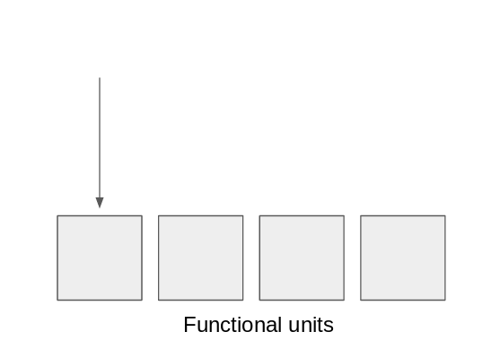
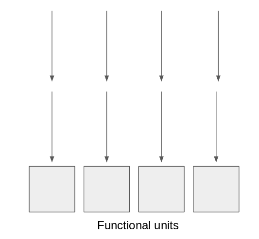

# Latency, Througput Instruction Set (LaTIS) Benchmark for x86
This project provides a simple interface to benchmark/add new benchmark suite for x86 instruction set.
It gives programmers rough estimate of latency and throughput of a particular machine that can be helpful
to develop optimized kernel for high performance computing.

### Basic Idea
In order to write a high performance kernel, programmers need to know basic parameters of the hardware such as how many
functional units are available, or how long do those units take to service a request. This benchmark creates chains of 
dependent instructions to exhaust the latency of those functional units, while at the same time iteratively increases
the number of independent chains to see how many units there are. This simple routine allows programmer to estimate 
the latency and throughput of the kernel. Following images illustrate the benchmark.




Latency: 1 chain of dependent instructions prevent multiple functional units to compute the program, forcing 1 unit to run the program by itself



Throughput: up to 4 independent chains of depedent instructions can be executed at the same time. Therefore, there will be a sharp performance drop when computing the fifth chain. We detect this drop to determine the throughput of the program

### How to run
```
python3 ./src/driver.py #further instruction is incorperated in the shell.
```

### Things still need to be done
* Write a script that automatized the benchmark. Write now the executables are made but are not run.
* Add basic ISA to the database.
* Run benchmark on known system.
* Write a script to visualize the spike in throughput benchmark.
